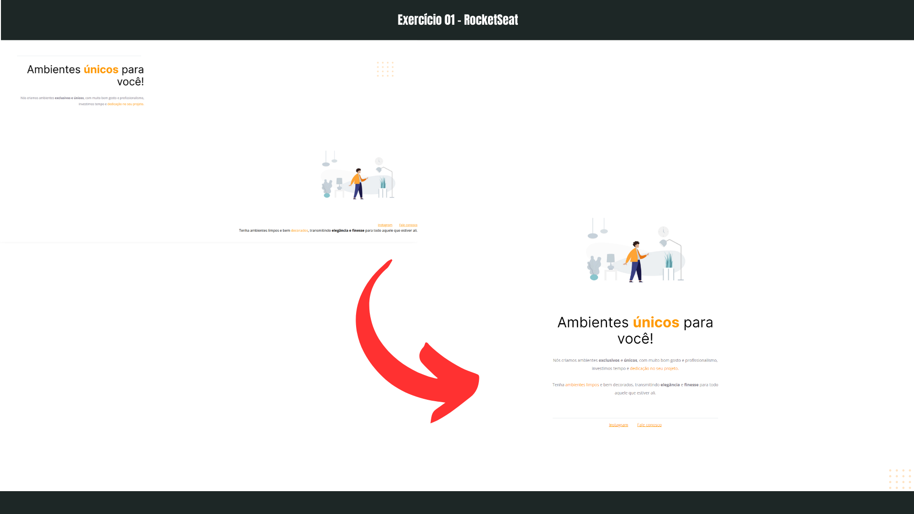

<h1 align="center"> Projeto 01 - RocketSeat </h1>

Móveis Customizados 

  <a href="#-tecnologias">Tecnologias</a>&nbsp;&nbsp;&nbsp;|&nbsp;&nbsp;&nbsp;
  <a href="#-Exercícios">Projeto</a>&nbsp;&nbsp;&nbsp;
  

 

  

## 🚀 Tecnologias

Esse projeto foi desenvolvido com as seguintes tecnologias:

- HTML e CSS
- Git e Github
- Figma

## 💻 Exercício

Foi recebido um código contendo diversos bugs, e o ecercício era reoganizar tudo para que ficasse como descrito no projeto Figma.

- [Acesse o projeto corrigido, online](https://viniciuszmota.github.io/Exercicio-Bug-01-RS/)

---

Feito com ♥ by Vinicius Zamprogno Mota, estudante na Rocketseat 👋 
